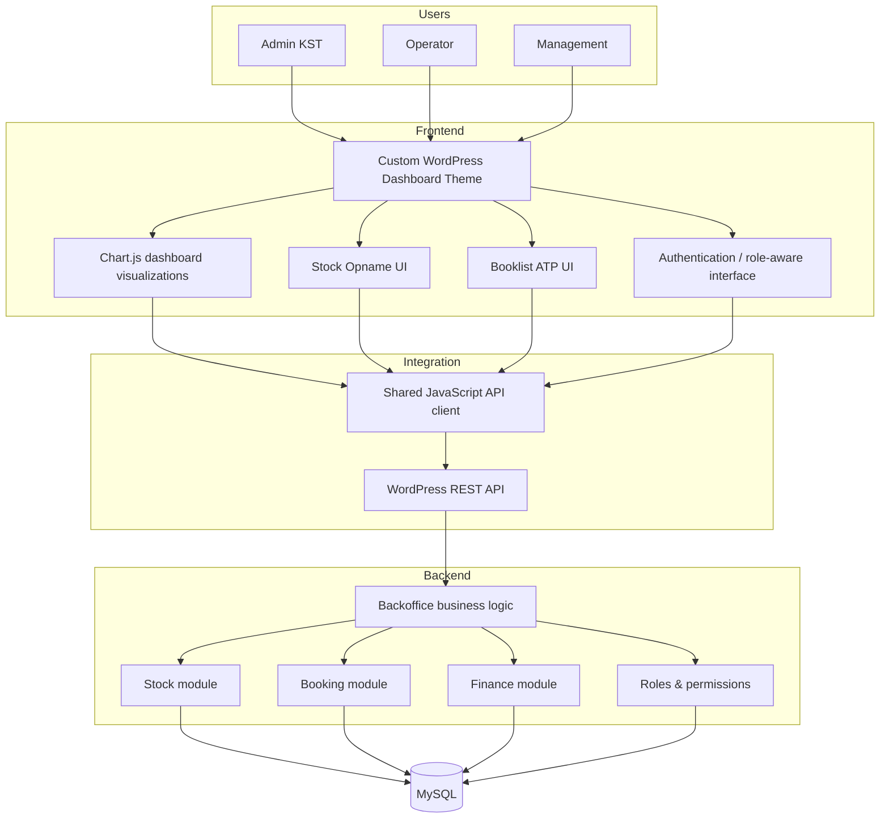
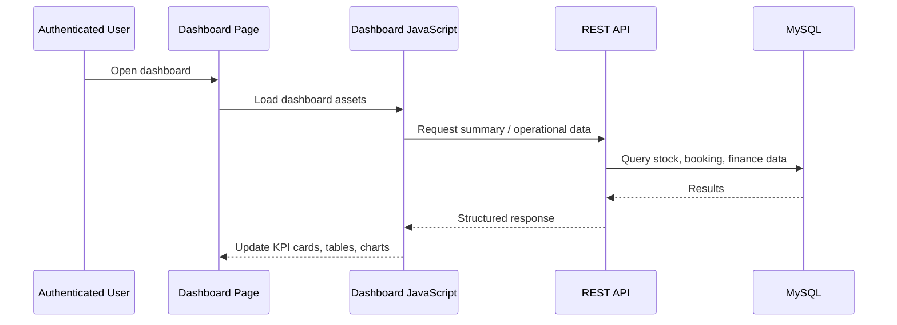

# Architecture

## System view

The capstone used WordPress as the application platform, with a custom operational dashboard and REST-based data exchange between the frontend and backend modules.



## Frontend integration pattern

The custom theme registered shared frontend assets and configured a REST base URL for JavaScript. A common API layer was then reused by the dashboard, booking, and stock scripts.

Conceptually:

```text
WordPress page template
        |
        v
feature-specific JavaScript
        |
        v
shared API client
        |
        v
/wp-json/kstcangar/v1/...
        |
        v
backend module + MySQL
```

This separation made it possible for the dashboard to render server-backed data while keeping feature-specific UI logic in independent scripts.

## Authentication and access control

The system combined two layers:

1. **Server-side access checks** before rendering protected WordPress pages.
2. **Role-aware frontend presentation**, where available navigation/actions differed by the authenticated user's role.

The capstone report states that login redirection and role-specific menu access were tested. It also records one remaining RBAC presentation bug at project close: a validation action could still appear for an operator role even though that action should be admin-only.

## Dashboard data flow



## Portfolio scope

This repository does not copy the entire WordPress installation. WordPress core and unrelated team files are intentionally omitted. The original collaborative source remains the canonical source repository:

https://github.com/gilanghfizh/kstcangar-wp

See [source-reference/README.md](source-reference/README.md) for direct paths to the implementation areas most relevant to this case study.
