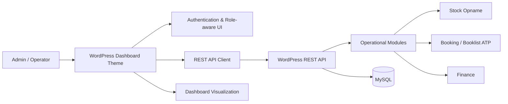

# KST Cangar Edu-Agrotourism Analytics Platform

> Portfolio case study of a collaborative capstone project developed for **KST Cangar, Universitas Brawijaya**. This repository highlights the frontend, dashboard, data-visualization, authentication/RBAC presentation, and frontend-backend integration work that I contributed to the team project.

[](https://github.com/gilanghfizh/kstcangar-wp)
[](#my-contribution)
[](#project-context)

## Project Summary

KST Cangar previously relied on fragmented and largely manual operational records across inventory, facility booking, and financial activities. The capstone team built a web-based information system to centralize those workflows and make operational data easier to monitor from one dashboard.

The system covered:

- Admin dashboard with operational summaries and charts
- Stock Opname management
- Facility / ATP booking management
- Financial-record management
- Login and authentication flow
- Role-Based Access Control (RBAC)
- REST API integration between frontend and WordPress backend
- Public landing page for KST Cangar information

## My Contribution

**Role: Frontend Developer & Data Visualization**

My documented contribution focused on the admin-facing experience and frontend-backend integration:

- Implemented the **Admin Dashboard** UI and operational summary views
- Built and refined the **Stock Opname** frontend workflow
- Built and refined the **Booklist ATP / booking** frontend workflow
- Integrated dashboard and modules with the project's **REST API**
- Implemented and debugged the **login / logout** flow
- Applied **role-aware UI / RBAC behavior** to dashboard navigation and actions
- Synchronized API data into dashboard components and charts
- Adjusted frontend parsing when backend response contracts changed
- Performed end-to-end integration testing and UI bug fixing before the final demo

This was a **six-person team project**, not a solo project. Backend/API, database/hosting, business analysis, UI/UX design, documentation, and the public landing page were shared across other team members. See [CONTRIBUTIONS.md](CONTRIBUTIONS.md) for attribution and commit-level proof.

## Implementation Evidence

### Admin Dashboard


The dashboard consolidates stock, booking, and revenue-oriented operational information into a single admin view. The final report also documents Stock Opname, Booklist ATP, login/authentication, and public landing-page screens.

More visual evidence context: [docs/screenshots/README.md](docs/screenshots/README.md)

## Curated Source Code

This repository now includes a **sanitized subset of the frontend/theme integration code** that is most relevant to my contribution:

```text
src/
└── theme/
    ├── functions.php
    └── assets/js/
        ├── api.js
        ├── dashboard.js
        ├── stok.js
        ├── booking.js
        └── login-helper.example.js
```

Key files:

- [`api.js`](src/theme/assets/js/api.js) - authenticated REST request helper, method override handling, JSON validation, and API error handling
- [`dashboard.js`](src/theme/assets/js/dashboard.js) - summary loading, Chart.js visualization, stock activity, and recent booking rendering
- [`stok.js`](src/theme/assets/js/stok.js) - Stock Opname state, filtering, calculations, and REST CRUD integration
- [`booking.js`](src/theme/assets/js/booking.js) - booking state, status summaries, payload mapping, and REST CRUD integration
- [`login-helper.example.js`](src/theme/assets/js/login-helper.example.js) - sanitized authentication example
- [`functions.php`](src/theme/functions.php) - WordPress asset wiring and runtime REST configuration

The full WordPress installation is intentionally **not** copied here. WordPress core, default plugins/themes, uploads, database exports, and unrelated team-wide files would make a portfolio review harder and could expose unnecessary data.

See [src/README.md](src/README.md) for scope and attribution.

## Architecture



More detail: [ARCHITECTURE.md](ARCHITECTURE.md)

## Engineering Highlights

| Area | Implementation focus |
| --- | --- |
| Dashboard | KPI cards, operational summaries, Chart.js data visualization |
| Stock | Stock movement, filtering, calculations, input/edit/delete flow |
| Booking | Booking list, reservation status, summary cards, CRUD integration |
| API integration | Shared API client and dynamic data loading from WordPress REST endpoints |
| Authentication | Login/logout integration and token-based frontend flow |
| RBAC presentation | Role-aware navigation and interface restrictions |
| Integration debugging | Adapting frontend behavior to changing backend response contracts |

## Functional Evaluation

The final team report documented functional testing for login, role-based access, stock input/validation, booking flows, and financial records. Non-functional evaluation covered usability, browser compatibility, basic access control, and response time.

The report also documented remaining limitations at the end of the capstone, including:

- an RBAC UI issue where a validation action could still appear for an operator role,
- additional mobile dashboard optimization,
- dashboard-heavy pages requiring further performance optimization,
- a booking-capacity validation item whose status was inconsistent across sections of the final team documentation.

I keep these limitations visible because this repository is intended as a credible engineering case study rather than a claim that every edge case was production-ready.

See [TESTING.md](TESTING.md) and [LIMITATIONS.md](LIMITATIONS.md).

## Verified Contribution History

My GitHub account appears directly in the original collaborative repository history. Representative commits:

- [`9c03bd1` - Update dashboard frontend](https://github.com/gilanghfizh/kstcangar-wp/commit/9c03bd144337e43ace2a9289a6f58aec4cfb4c9a)
- [`2ce78e0` - final admin dashboard](https://github.com/gilanghfizh/kstcangar-wp/commit/2ce78e02ae394d394e88e8146fad0ea8e3c9fba9)
- [`82cff17` - fix: admin panel](https://github.com/gilanghfizh/kstcangar-wp/commit/82cff1751e27339788bf57e4cc8f9d528d77abed)
- [`4e1bf72` - feat: connect dashboard, stock opname and booklist to backend](https://github.com/gilanghfizh/kstcangar-wp/commit/4e1bf72e4d4450e81d79d5d709aebfecc083bc89)

The integration commit includes changes across the API client, dashboard, Stock Opname, booking, login helper, and WordPress theme integration.

## Repository Guide

```text
.
├── README.md
├── ARCHITECTURE.md
├── CONTRIBUTIONS.md
├── TESTING.md
├── LIMITATIONS.md
├── PORTFOLIO.md
├── SECURITY.md
├── docs/
│   ├── project-overview.md
│   ├── frontend-integration.md
│   └── screenshots/
├── src/
│   ├── README.md
│   └── theme/
└── source-reference/
    └── README.md
```

### Documentation

- [Project and problem context](docs/project-overview.md)
- [Frontend/API integration notes](docs/frontend-integration.md)
- [Architecture](ARCHITECTURE.md)
- [Contribution evidence & attribution](CONTRIBUTIONS.md)
- [Testing](TESTING.md)
- [Known limitations](LIMITATIONS.md)
- [Security & sanitization](SECURITY.md)
- [Portfolio-ready description](PORTFOLIO.md)
- [Original source references](source-reference/README.md)

## Tech Stack

`WordPress` · `PHP` · `JavaScript` · `REST API` · `MySQL` · `Chart.js` · `HTML/CSS` · `Git/GitHub`

## Project Context

- **Project:** Sistem Informasi Terintegrasi STP UB: KST Cangar & Edu-Agrotourism Analytics
- **Case study / partner:** KST UB Cangar
- **Team:** 6 students across Informatics, Information Systems, and Information Technology
- **Year:** 2026

## Security & Sanitization

The original collaborative codebase contains environment-specific implementation details. This public portfolio repository does not reproduce credentials, tokens, database dumps, private configuration, or other sensitive values. One authentication helper from the team repository contained hard-coded environment credentials, so this portfolio uses a sanitized runtime-login example instead.

See [SECURITY.md](SECURITY.md).

## Attribution

This repository is a **portfolio-oriented reconstruction of my contribution** to a collaborative university capstone. It does not claim sole authorship of the overall system.

Original collaborative repository: https://github.com/gilanghfizh/kstcangar-wp
