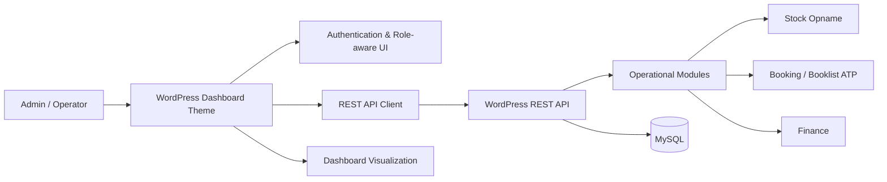

# KST Cangar Edu-Agrotourism Analytics Platform

> Portfolio case study of a collaborative capstone project developed for **KST Cangar, Universitas Brawijaya**. This repository focuses on the frontend, dashboard, API-integration, authentication, and operational-module work that I contributed to the team project.

[](https://github.com/gilanghfizh/kstcangar-wp)
[](#my-contribution)
[](#project-context)

## Overview

KST Cangar previously relied on fragmented and largely manual operational records across inventory, facility booking, and financial activities. The team built a web-based information system to centralize those workflows and make operational data easier to monitor from a single dashboard.

The final system covered:

- Admin dashboard with operational summaries and charts
- Stock Opname management
- Facility / ATP booking management
- Financial-record management
- Login and authentication flow
- Role-Based Access Control (RBAC)
- REST API integration between frontend and WordPress backend
- Public landing page for KST Cangar information

## My Contribution

**Role: Frontend Developer & Data Visualization**

My documented contribution focused on the admin-facing experience and frontend-backend integration:

- Implemented the **Admin Dashboard** UI and operational summary views
- Built and refined the **Stock Opname** frontend workflow
- Built and refined the **Booklist ATP / booking** frontend workflow
- Integrated dashboard and modules with the project's **REST API**
- Implemented and debugged the **login / logout** flow
- Applied **role-aware UI / RBAC behavior** to dashboard navigation and actions
- Synchronized API data into dashboard components
- Debugged API response changes and integration errors across modules
- Performed end-to-end integration testing and UI bug fixing before the final demo

This was a **team project**, not a solo project. Backend/API, database/hosting, business analysis, UI/UX design, documentation, and the public landing page were shared across other team members. See [CONTRIBUTIONS.md](CONTRIBUTIONS.md) for attribution and source-proof links.

## Visual Evidence

### Admin Dashboard


Operational overview combining inventory, booking, and revenue-oriented summary components.

### Stock Opname


Inventory workflow with weekly stock movement, filters, summary cards, and structured tabular input.

### Booklist ATP


Booking management interface for visitor/facility reservations and payment/status monitoring.

### Login & Access Flow


Authentication entry point used before accessing role-based operational pages.

## Architecture



The portfolio repository intentionally presents the system at an engineering-case-study level rather than copying the full WordPress installation. WordPress core, default themes/plugins, uploads, and unrelated generated files are omitted so the project contribution is easier to review.

## Engineering Highlights

| Area | Implementation focus |
| --- | --- |
| Dashboard | KPI cards, inventory/booking summaries, visualization components |
| Stock | Weekly stock movement, stock-in/out/return data, filtering and input workflow |
| Booking | Booking list, reservation data, status/payment-oriented UI |
| API integration | Shared API client and dynamic data loading from WordPress REST endpoints |
| Authentication | Login/logout integration and authenticated dashboard flow |
| RBAC | Role-aware navigation and interface restrictions |
| Integration debugging | Adjusting frontend parsing and behavior as backend response contracts changed |

## Functional Evaluation

The final team report documented functional testing across login, role-based access, stock input and validation, booking flows, and financial records. Non-functional evaluation also covered usability, browser compatibility, basic access control, and response time.

The report also documented remaining limitations at the end of the capstone, including:

- an RBAC UI issue where a validation action could still appear for an operator role,
- additional mobile dashboard optimization,
- dashboard-heavy pages requiring further performance optimization,
- a booking-capacity validation item whose final status was inconsistent across team documentation.

I keep these limitations visible because this repository is intended as a credible engineering case study, not a polished claim that every edge case was complete.

More detail: [TESTING.md](TESTING.md) and [LIMITATIONS.md](LIMITATIONS.md).

## Verified Contribution History

My GitHub account appears directly in the original collaborative repository history. Representative commits include:

- [`9c03bd1` - Update dashboard frontend](https://github.com/gilanghfizh/kstcangar-wp/commit/9c03bd144337e43ace2a9289a6f58aec4cfb4c9a)
- [`2ce78e0` - final admin dashboard](https://github.com/gilanghfizh/kstcangar-wp/commit/2ce78e02ae394d394e88e8146fad0ea8e3c9fba9)
- [`82cff17` - fix: admin panel](https://github.com/gilanghfizh/kstcangar-wp/commit/82cff1751e27339788bf57e4cc8f9d528d77abed)
- [`4e1bf72` - feat: connect dashboard, stock opname and booklist to backend](https://github.com/gilanghfizh/kstcangar-wp/commit/4e1bf72e4d4450e81d79d5d709aebfecc083bc89)

The last commit above includes integration changes across the API client, dashboard, Stock Opname, booking, login helper, and WordPress theme integration.

## Repository Guide

```text
.
├── README.md
├── ARCHITECTURE.md
├── CONTRIBUTIONS.md
├── TESTING.md
├── LIMITATIONS.md
├── PORTFOLIO.md
├── docs/
│   ├── project-overview.md
│   ├── frontend-integration.md
│   └── screenshots/
└── source-reference/
    └── README.md
```

### Important links

- [Project and problem context](docs/project-overview.md)
- [Frontend/API integration notes](docs/frontend-integration.md)
- [Architecture](ARCHITECTURE.md)
- [Contribution evidence & attribution](CONTRIBUTIONS.md)
- [Testing](TESTING.md)
- [Known limitations](LIMITATIONS.md)
- [Portfolio-ready description](PORTFOLIO.md)
- [Original source references](source-reference/README.md)

## Tech Stack

`WordPress` · `PHP` · `JavaScript` · `REST API` · `MySQL` · `Chart.js` · `HTML/CSS` · `Git/GitHub`

## Project Context

- **Project:** Sistem Informasi Terintegrasi STP UB: KST Cangar & Edu-Agrotourism Analytics
- **Case study / partner:** KST UB Cangar
- **Team:** 6 students across Informatics, Information Systems, and Information Technology
- **Year:** 2026

## Attribution

This repository is a **portfolio-oriented reconstruction of my contribution** to a collaborative university capstone. It does not claim sole authorship of the overall system.

Original collaborative repository:

https://github.com/gilanghfizh/kstcangar-wp

Screenshots in this repository are extracted from the team's final capstone report and are included only as implementation evidence for this portfolio case study.
